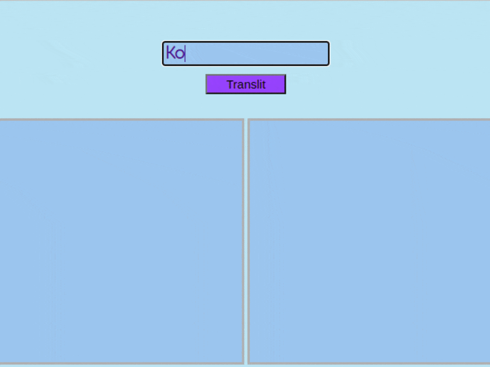

# Мини-приложение Translit
Реализует транслитерацию слов с кириллицы на латиницу. При вводе длинного слова его часть обрезается и заменяется троеточием, слово полностью можно увидеть при наведении на него курсора.
######
                                                                                                                
